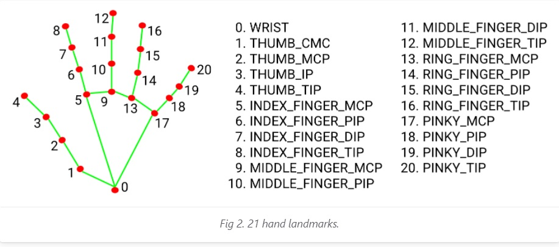

# English Readme

## Description
This program uses to experiment with computer vision (with the opencv library and mediapipe). You can only use right hand, but further versions will work with lefthanded people. 

## How to Play
Start the project in the main.py and raise your right hand! Program will detect your hand and all the landmarks. On the screen you will see the counter (3-2-1), and then screenshot will be made.

Computer moves are random, and you will see computer move on the right and result on the bottom.

If you want to exit game, just press "q" on the keyboard.

Good Luck!

## Project Setup
1. Donwload the files from GH repositorium.
2. Create virtual environment and install all the needed libraries 

`pip3 install -r requirements.txt`

3. Check if you have a camera on your laptop or PC. 
4. Start the main.py 

## About The Project
### In the code you can find:
- HandTrackingModule, which includes Google MediaPipe Library and some external functions for usability. Notable one - heuristics for detecting hand shape in function:
`detect_rps_hand_shape()`

- GameLogic module, in which contained all RockPaperScissors Rules (not very much of them actually) and our result function, which add to final screenshot computer move and result.
- Utils module - few functions that works with CV2 and our CONSTANTS.  

### Technologies in this Project:
- OpenCV (computer vision library)
- Google MediaPipe
- Numpy (cause all the images-frames converts to grayscale)

### Technologies to add in further versions:
- Scikit and some machine learning assembly. This process will work with multiprocessing library as a second subprocess, and will make computer moves not random, but smart and weighted towards specific player weaknesses and tendencies.
- Some GUI maybe?  
- Work with left-hand. It's simple, but i'm lazy...

# Ридми на родимом русском

## Описание
Эта программа экспериментирует с библиотеками компьютерного видения (opencv и mediapipe). Вы можете использовать только правую руку, но дальнейшие версии будут поддерживать и левшей.

## Как играть?
Запустите main.py и поднимите правую руку. Программа определит вашу вашу и все ключевые точки. На экране вы увидите обратный отсчет (3-2-1), и затем будет сделан скриншот.

Компьютерные ходы полностью рандомны, и вы увидите ход компьютера справа, а результат снизу на скриншоте.

Если вы заходите выйти, то просто нажмите "q" на клавиатуре.

Удачи!

## Запуск проекта
1. Загрузите файлы с репозитория на GH.
2. Создайте виртуальное окружение и установите в него все нужные библиотеки:

`pip3 install -r requirements.txt`

3. Запустите `main.py` 

## О проекте
### В коде программы вы сможете найти:

- HandTrackingModule, который состоит из Гугловской Mediapipe и некоторый внешних оборачивающих функций. Самая заметная - эвристика, позволяющая определить форму руки:
`detect_rps_hand_shape()`

- GameLogic module, в котором сосредоточены все правила игры в Камень-Ножницы-Бумагу (а их откровенно мало) и наша результирующая функция, которая добавляет к финальному скриншоту ход компьютера и результат игры.
- Utils module - несколько функций для работы с CV2 и наши КОНСТАНТЫ.

### Технологии в проекте:
- OpenCV (computer vision library)
- Google MediaPipe
- Numpy (потому что все изображения-кадры мы предварительно конвертируем в черно-белые)

### Технологии, которые необходимо добавить в следующих версиях:
- Scikit и какой-нибудь ансамбль машинного обучения. Он будет работать через модуль multiprocessing как второй субпроцесс, и сделает компьютерные ходы не рандомными, а умными и направленными против слабости конкретного игрока.
- GUI
- Подстройку к левшам. # RPS_game

